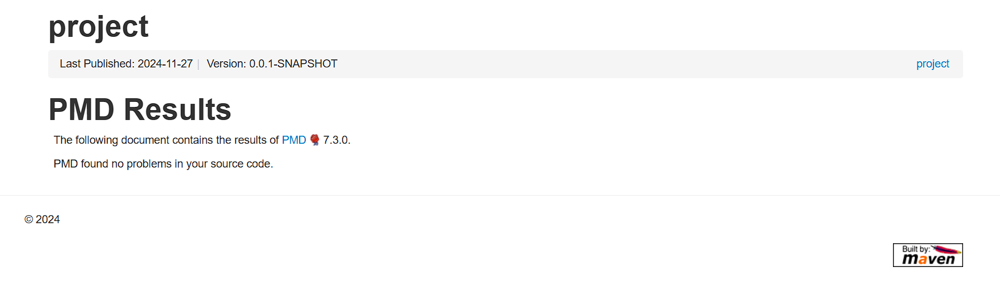

# 4156-Team-project
This is the repository for the team project of the team Null Terminators.

Team Members:

Abhilash Ganga (ag4797), Ajit Sharma Kasturi (ak5055), Hamsitha Challagundla (hc3540), Madhura Chatterjee (mc5470),  Samhit Chowdary Bhogavalli (sb4845)


## Dependencies

In order to build and use our service you must install the following:

* Maven 3.9.9: https://maven.apache.org/download.cgi
* JDK 17: https://www.oracle.com/java/technologies/javase/jdk17-archive-downloads.html
* IDE: VSCode / IntelliJ

## Testing

All our unit tests for this project are located in the directory "src/test". Run `mvn test` to run the tests.

## Style Check

Command: `mvn checkstyle:check`

## Static Code Analysis

To generate the static code analysis report, run the following command: 

```bash
mvn pmd:check
```
You can find the report at `target/pmd.xml`

I used the following plugin for pmd static bug analyzer.
```declarative
<plugin>
    <groupId>org.apache.maven.plugins</groupId>
    <artifactId>maven-pmd-plugin</artifactId>
    <version>3.25.0</version>
    <configuration>
        <rulesets> <ruleset>/rulesets/java/maven-pmd-plugin-default.xml</ruleset> </rulesets>
    </configuration>
</plugin>
```

## Endpoints

This section describes the endpoints that our service provides, as well as their inputs and outputs.

### Authentication:

All API's listed below except for registerCompany are protected by basic authentication. the client (Company) must provide a valid username and password to access the API's and each client can only access data which they have created and cannot access other clients data.

### Company Management:

POST /registerCompany
* Expected Input Parameters: company (Company) {username, password, name, address, state}
* Expected Output: Success or failure message
* Registers a new company with given details.
* Upon Success: HTTP 201 Status Code is returned along with "Company is registered successfully." in the response body.
* Upon Failure: HTTP 400 Status Code is returned along with appropriate message in the response body.

### Employee Profile Management (/employeeProfile):

#### GET /getAllEmployees, GET/

* Returns a String containing the list of all existing employee profiles.

#### GET /employeeProfile/{id}

* Expected Input Parameters: id (int)
* Expected Output: Details of the specified employee (String)
* Returns the employee profile by id
* Upon Success: HTTP 200 Status Code is returned along with details of the employee profile in the response body.
* Upon Failure: HTTP 404 Status Code is returned along with appropriate message in the response body.

#### POST /employeeProfile/createNewEmployee

* Expected Input Parameters: employeeProfile (EmployeeProfile)
* Expected Output: Success or failure message
* Creates new employee profile
* Upon Success: HTTP 200 Status Code is returned along with "Employee profile created successfully." in the response body.
* Upon Failure: HTTP 404 Status Code is returned along with appropriate message in the response body.

#### DELETE /employeeProfile/{id}

* Expected Input Parameters: id (int)
* Expected Output: Success or failure message
* Deletes existing employee profile
* Upon Success: HTTP 200 Status Code is returned along with "Employee profile successfully deleted." in the response body.
* Upon Failure: HTTP 404 Status Code is returned along with appropriate message in the response body.

### Timeoff Records Management (/timeoff):

#### GET /timeoff/{employeeId}

* Expected Input Parameters: employeeId (Integer)
* Expected Output: List of TimeOff records or error message
* Retrieves all time-off requests for a specific employee
* Upon Success: HTTP 200 Status Code is returned along with the list of time-off records in the response body.
* Upon Failure: HTTP 404 Status Code is returned if the employee does not exist or no time-off records are found.

#### GET /timeoff/{employeeId}/range

* Expected Input Parameters: employeeId (Integer), startDate (String), endDate (String)
* Query Parameter: startDate & endDate (YYYY-MM-DD)
* Expected Output: List of TimeOff records or error message
* Retrieves time-off requests for a specific employee within a specified date range
* Upon Success: HTTP 200 Status Code is returned along with the list of time-off records in the response body.
* Upon Failure: HTTP 404 Status Code is returned if the employee does not exist, no time-off requests are found in the specified range, or if validation fails.

#### POST /timeoff/create

* Expected Input - Request body: timeOff (TimeOff) 
* Expected Output: Success or failure message
* Creates a new time-off request for a specific employee
* Upon Success: HTTP 201 Status Code is returned along with the created time-off request in the response body.
* Upon Failure: HTTP 404 Status Code is returned if the employee does not exist or any other validation error occurs.

#### PUT /timeoff/{employeeId}/{timeOffId}/update-status
* Expected Input Parameters: employeeId (Integer), timeOffId (Integer), action (String) (approve/reject or cancel)
* Query Parameter: action (String) (approve/reject or cancel)
* Expected Output: Success or failure message
* Updates the status of a specific time-off request
* Upon Success: HTTP 200 Status Code is returned along with a success message in the response body.
* Upon Failure: HTTP 404 Status Code is returned if the employee does not exist, the time-off request is not found, or if the action is not applicable.

### Payroll Management (/payroll):

#### GET /payroll/{employeeId}

* Expected Input Parameters: employeeId (Integer)
* Expected Output: List of Payroll records or error message
* Retrieves all payroll records for a specific employee which includes the salary, deductions and net pay
* Upon Success: HTTP 200 Status Code is returned along with the list of payroll records in the response body.
* Upon Failure: HTTP 404 Status Code is returned if the employee does not exist or no records are found.

#### PATCH /payroll/{employeeId}/markPaid

* Expected Input Parameters: employeeId (Integer), month (Integer) in MM, year (Integer) in YYYY in request body (JSON format).
* Expected Output: Success or failure message
* Marks a specific payroll record as paid for a given month and year
* Upon Success: HTTP 200 Status Code is returned along with a success message in the response body.
* Upon Failure: HTTP 404 Status Code is returned if the employee does not exist or if payroll for the month and year does not exist or if the flag is already set and HTTP 400 Status Code if month and year are missing or not in the correct format.

#### PATCH /payroll/{employeeId}/markUnpaid

* Expected Input Parameters: employeeId (Integer), month (Integer) in MM, year (Integer) in YYYY in request body (JSON format).
* Expected Output: Success or failure message
* Marks a specific payroll record as unpaid for a given month and year
* Upon Success: HTTP 200 Status Code is returned along with a success message in the response body.
* Upon Failure: HTTP 404 Status Code is returned if the employee does not exist or if payroll for the month and year does not exist or if the flag is already not set and HTTP 400 Status Code if month and year are missing or not in the correct format.

#### PATCH /payroll/{employeeId}/adjustSalary

* Expected Input Parameters: employeeId (Integer), month (Integer) in MM, year (Integer) in YYYY, salary (Integer) in request body (JSON format).
* Expected Output: Success or failure message
* Adjusts the salary for a specific employee for a given month and year
* Upon Success: HTTP 200 Status Code is returned along with a success message in the response body.
* Upon Failure: HTTP 404 Status Code is returned if the employee does not exist or if payroll for the month and year does not exist and HTTP 400 Status Code if month, year and salary are missing or not in the correct format.

#### PATCH /payroll/{employeeId}/adjustDay

* Expected Input Parameters: employeeId (Integer), day (Integer) in DD, month (Integer) in MM, year (Integer) in YYYY in request body (JSON format).
* Expected Output: Success or failure message
* Adjusts the payment day for a specific employee for a given month and year
* Upon Success: HTTP 200 Status Code is returned along with a success message in the response body.
* Upon Failure: HTTP 404 Status Code is returned if the employee does not exist or if payroll for the month and year does not exist and HTTP 400 Status Code if day, month, and year are missing or in the correct format.

#### POST /payroll/{employeeId}/addPayroll

* Expected Input Parameters: employeeId (Integer), day (Integer) in DD, month (Integer) in MM, year (Integer) in YYYY and salary (Integer) in request body (JSON format).
* Expected Output: Success or failure message
* Creates a new payroll record for a specific employee
* Upon Success: HTTP 200 Status Code is returned along with a success message in the response body.
* Upon Failure: HTTP 404 Status Code is returned if the employee does not exist and HTTP 409 Status Code if the payroll for the month and year already exists and HTTP 400 Status Code day, month, year and salary are missing or not in the correct format.

#### DELETE /payroll/{employeeId}/deletePayroll

* Expected Input Parameters: employeeId (Integer), month (Integer) in MM, year (Integer) in YYYY in request body (JSON format).
* Expected Output: Success or failure message
* Deletes a specific payroll record for a specific employee
* Upon Success: HTTP 200 Status Code is returned along with a success message in the response body.
* Upon Failure: HTTP 404 Status Code is returned if the employee does not exist or if payroll for the month and year does not exist and HTTP 400 Status Code if day, month, and year are missing or in the correct format.

#### POST /payroll/generatePayroll

* Expected Input Parameters: month (Integer) in MM, year (Integer) in YYYY in request body (JSON format).
* Expected Output: Success or failure message
* Generates payroll records for all employees in the company for a given month and year
* Upon Success: HTTP 200 Status Code is returned along with a success message in the response body.
* Upon Failure: HTTP 400 Status Code is returned if month and year are missing or not in the correct format.

#### DELETE /payroll/deletePayroll

* Expected Input Parameters: month (Integer) in MM, year (Integer) in YYYY in request body (JSON format).
* Expected Output: Success or failure message
* Deletes all payroll records for all employees in the company for a given month and year
* Upon Success: HTTP 200 Status Code is returned along with a success message in the response body.
* Upon Failure: HTTP 400 Status Code is returned if month and year are missing or not in the correct format.

### Employee Hierarchy (/api/employee-hierarchy)

#### POST /addEdge/{supervisorId}/{employeeId}

* Expected Input Parameters: supervisorId (Integer), employeeId (Integer)
* Expected Output: Success or failure message
* Adds a new edge in the employee hierarchy
* Upon Success: HTTP 200 Status Code is returned along with a success message in the response body.
* Upon Failure: HTTP 404 Status Code is returned if the employee does not exist and HTTP 400 Status Code if the supervisor is not an employee and HTTP 409 Status Code if the edge already exists.

#### GET /subordinates/{fromEmployeeId}

* Expected Input Parameters: fromEmployeeId (Integer)
* Expected Output: List of subordinates of the employee or error message
* Retrieves all subordinates of a specific employee
* Upon Success: HTTP 200 Status Code is returned along with the list of subordinates in the response body.
* Upon Failure: HTTP 404 Status Code is returned if the employee does not exist.

#### GET /supervisor/{toEmployeeId}

* Expected Input Parameters: toEmployeeId (Integer)
* Expected Output: Supervisor of the employee or error message
* Retrieves the supervisor of a specific employee
* Upon Success: HTTP 200 Status Code is returned along with the supervisor in the response body.
* Upon Failure: HTTP 404 Status Code is returned if the employee does not exist or if the employee has no supervisor.

#### GET /tree/{employeeId}

* Expected Input Parameters: employeeId (Integer)
* Expected Output: The tree of employees with the specified employee as the root or error message
* Retrieves the tree of employees with the specified employee as the root
* Upon Success: HTTP 200 Status Code is returned along with the tree in the response body.
* Upon Failure: HTTP 404 Status Code is returned if the employee does not exist.

#### DELETE /removeEdge/{employeeId}

* Expected Input Parameters: employeeId (Integer)
* Expected Output: Success or failure message
* Deletes the edge from a specific employee to their supervisor
* Upon Success: HTTP 200 Status Code is returned along with a success message in the response body.
* Upon Failure: HTTP 404 Status Code is returned if the employee does not exist and HTTP 400 Status Code if the employee is not an employee and HTTP 409 Status Code if the edge does not exist.

## Postman Testing
The Postman Collection is located in the `postman` folder.

## Reporting

#### Style Check Report
After the style check command is run, the report is generated in the `target/site` folder as html file.


#### Branch Coverage Report
After the test coverage command is run, the report is generated in the `target/site/jaCoCo` folder as html file.
This project has 94% branch coverage.


#### PMD Report
After the PMD check command is run, the report is generated in the `target/report` folder as html file.

